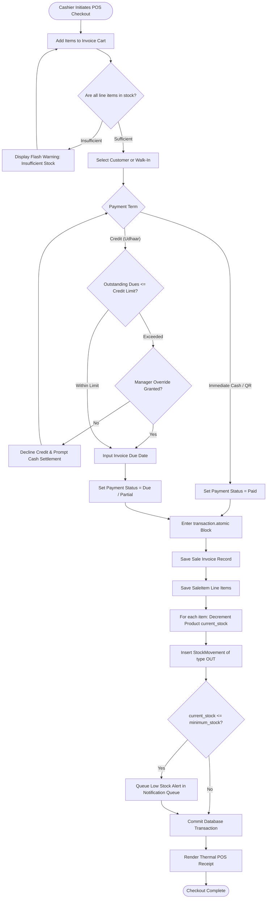

# Visual Architecture: Activity Flow Diagrams

> **BizFlow Activity & Business Logic Flows**  
> *Sales Invoice Generation and Inventory Stock Decrement Activity Flow rendered in Mermaid.*

---

```mermaid
flowchart TD
    Start([Cashier Initiates POS Checkout]) --> Scan[Add Items to Invoice Cart]
    Scan --> StockCheck{Are all line items in stock?}

    StockCheck -- Insufficient --> AlertError[Display Flash Warning: Insufficient Stock]
    AlertError --> Scan

    StockCheck -- Sufficient --> EnterParty[Select Customer or Walk-In]
    EnterParty --> ChoosePayment{Payment Term}

    ChoosePayment -- Immediate Cash / QR --> SetPaid[Set Payment Status = Paid]
    ChoosePayment -- Credit (Udhaar) --> ValidateLimit{Outstanding Dues <= Credit Limit?}

    ValidateLimit -- Exceeded --> RequireOverride{Manager Override Granted?}
    RequireOverride -- No --> RejectCredit[Decline Credit & Prompt Cash Settlement]
    RejectCredit --> ChoosePayment
    RequireOverride -- Yes --> SetDueDate[Input Invoice Due Date]
    ValidateLimit -- Within Limit --> SetDueDate
    SetDueDate --> SetDueStatus[Set Payment Status = Due / Partial]

    SetPaid & SetDueStatus --> BeginTx[Enter transaction.atomic Block]
    BeginTx --> SaveHeader[Save Sale Invoice Record]
    SaveHeader --> SaveLines[Save SaleItem Line Items]
    SaveLines --> LoopItems[For each item: Decrement Product current_stock]
    LoopItems --> CreateMovement[Insert StockMovement of type OUT]
    CreateMovement --> CheckMinStock{current_stock <= minimum_stock?}
    CheckMinStock -- Yes --> QueueAlert[Queue Low Stock Alert in Notification Queue]
    CheckMinStock -- No --> CommitTx[Commit Database Transaction]
    QueueAlert --> CommitTx

    CommitTx --> PrintReceipt[Render Thermal POS Receipt]
    PrintReceipt --> Finish([Checkout Complete])
```
