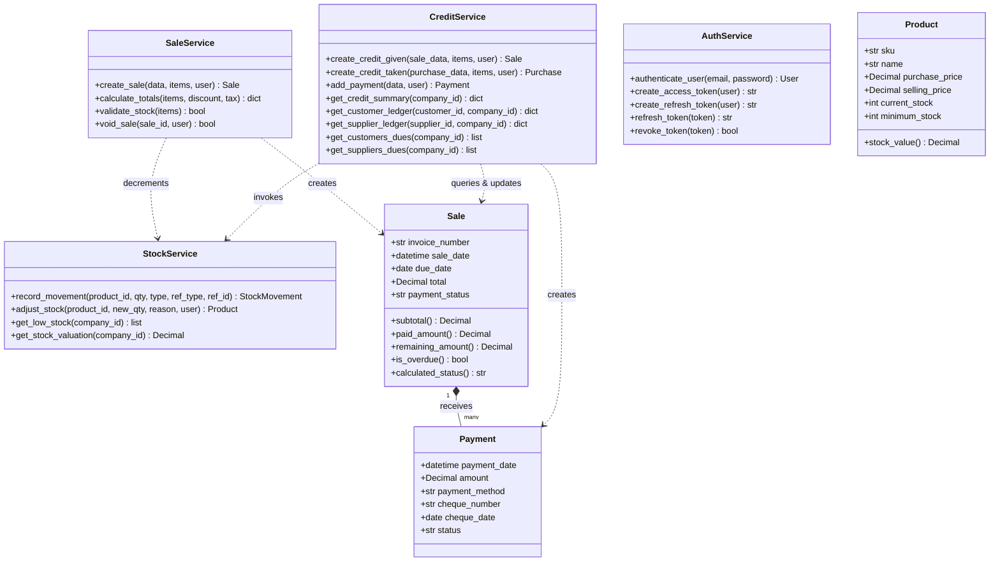

# Visual Architecture: Class & Service Diagram

> **BizFlow Domain & Service Class Structure**  
> *Core Domain Services, Models, and Repositories rendered in Mermaid.*

---

```mermaid
classDiagram
    class CreditService {
        +create_credit_given(sale_data, items, user) Sale
        +create_credit_taken(purchase_data, items, user) Purchase
        +add_payment(data, user) Payment
        +get_credit_summary(company_id) dict
        +get_customer_ledger(customer_id, company_id) dict
        +get_supplier_ledger(supplier_id, company_id) dict
        +get_customers_dues(company_id) list
        +get_suppliers_dues(company_id) list
    }

    class SaleService {
        +create_sale(data, items, user) Sale
        +calculate_totals(items, discount, tax) dict
        +validate_stock(items) bool
        +void_sale(sale_id, user) bool
    }

    class StockService {
        +record_movement(product_id, qty, type, ref_type, ref_id) StockMovement
        +adjust_stock(product_id, new_qty, reason, user) Product
        +get_low_stock(company_id) list
        +get_stock_valuation(company_id) Decimal
    }

    class AuthService {
        +authenticate_user(email, password) User
        +create_access_token(user) str
        +create_refresh_token(user) str
        +refresh_token(token) str
        +revoke_token(token) bool
    }

    class Product {
        +str sku
        +str name
        +Decimal purchase_price
        +Decimal selling_price
        +int current_stock
        +int minimum_stock
        +stock_value() Decimal
    }

    class Sale {
        +str invoice_number
        +datetime sale_date
        +date due_date
        +Decimal total
        +str payment_status
        +subtotal() Decimal
        +paid_amount() Decimal
        +remaining_amount() Decimal
        +is_overdue() bool
        +calculated_status() str
    }

    class Payment {
        +datetime payment_date
        +Decimal amount
        +str payment_method
        +str cheque_number
        +date cheque_date
        +str status
    }

    CreditService ..> Sale : queries & updates
    CreditService ..> Payment : creates
    CreditService ..> StockService : invokes
    SaleService ..> Sale : creates
    SaleService ..> StockService : decrements
    Sale "1" *-- "many" Payment : receives
```
