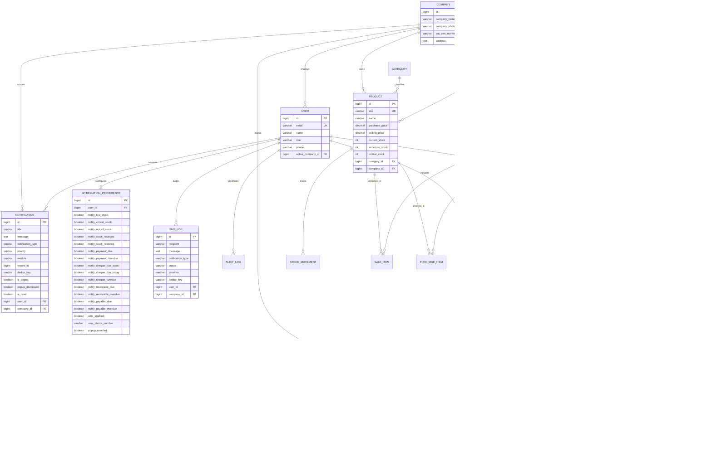

# Visual Architecture: Entity-Relationship (ER) Diagram

> **BizFlow Relational Data Model**  
> *Complete entity relationships, cardinality, and foreign keys rendered in Mermaid.*

---

```mermaid
erDiagram
    COMPANY ||--o{ USER : employs
    COMPANY ||--o{ PRODUCT : owns
    COMPANY ||--o{ CUSTOMER : serves
    COMPANY ||--o{ SUPPLIER : procures_from
    COMPANY ||--o{ SALE : executes
    COMPANY ||--o{ PURCHASE : contracts
    COMPANY ||--o{ CHEQUE : tracks
    COMPANY ||--o{ NOTIFICATION : scopes

    USER ||--o| NOTIFICATION_PREFERENCE : configures
    USER ||--o{ NOTIFICATION : receives
    USER ||--o{ SMS_LOG : audits
    USER ||--o{ CHEQUE : manages
    USER ||--o{ AUDIT_LOG : generates
    USER ||--o{ PAYMENT : creates

    CATEGORY ||--o{ PRODUCT : classifies
    SELLER ||--o{ PRODUCT : lists

    PRODUCT ||--o{ STOCK_MOVEMENT : tracks
    PRODUCT ||--o{ SALE_ITEM : contained_in
    PRODUCT ||--o{ PURCHASE_ITEM : ordered_in

    CUSTOMER ||--o{ SALE : buys
    CUSTOMER ||--o{ PAYMENT : pays
    CUSTOMER ||--o{ CHEQUE : issues_received_by

    SUPPLIER ||--o{ PURCHASE : sells
    SUPPLIER ||--o{ PAYMENT : receives
    SUPPLIER ||--o{ CHEQUE : accepts_given_to

    SALE ||--o{ SALE_ITEM : includes
    SALE ||--o{ PAYMENT : settled_by
    SALE ||--o{ CHEQUE : associated_with

    PURCHASE ||--o{ PURCHASE_ITEM : includes
    PURCHASE ||--o{ PAYMENT : settled_by
    PURCHASE ||--o{ CHEQUE : associated_with

    PAYMENT ||--o| CHEQUE : generates

    COMPANY {
        bigint id PK
        varchar company_name
        varchar company_phone
        varchar vat_pan_number
        text address
    }

    USER {
        bigint id PK
        varchar email UK
        varchar name
        varchar role
        varchar phone
        bigint active_company_id FK
    }

    PRODUCT {
        bigint id PK
        varchar sku UK
        varchar name
        decimal purchase_price
        decimal selling_price
        int current_stock
        int minimum_stock
        int critical_stock
        bigint category_id FK
        bigint company_id FK
    }

    CHEQUE {
        bigint id PK
        varchar cheque_type
        varchar cheque_number
        varchar bank_name
        decimal amount
        date cheque_date
        varchar status
        bigint customer_id FK
        bigint supplier_id FK
        bigint sale_id FK
        bigint purchase_id FK
        bigint payment_id FK
        bigint company_id FK
        bigint created_by_id FK
    }

    NOTIFICATION {
        bigint id PK
        varchar title
        text message
        varchar notification_type
        varchar priority
        varchar module
        bigint record_id
        varchar dedup_key
        boolean is_popup
        boolean popup_dismissed
        boolean is_read
        bigint user_id FK
        bigint company_id FK
    }

    NOTIFICATION_PREFERENCE {
        bigint id PK
        bigint user_id FK
        boolean notify_low_stock
        boolean notify_critical_stock
        boolean notify_out_of_stock
        boolean notify_stock_received
        boolean notify_stock_restored
        boolean notify_payment_due
        boolean notify_payment_overdue
        boolean notify_cheque_due_soon
        boolean notify_cheque_due_today
        boolean notify_cheque_overdue
        boolean notify_receivable_due
        boolean notify_receivable_overdue
        boolean notify_payable_due
        boolean notify_payable_overdue
        boolean sms_enabled
        varchar sms_phone_number
        boolean popup_enabled
    }

    SMS_LOG {
        bigint id PK
        varchar recipient
        text message
        varchar notification_type
        varchar status
        varchar provider
        varchar dedup_key
        bigint user_id FK
        bigint company_id FK
    }

    SALE {
        bigint id PK
        varchar invoice_number UK
        datetime sale_date
        date due_date
        decimal total
        varchar payment_status
        varchar payment_method
        bigint customer_id FK
        bigint company_id FK
    }

    PURCHASE {
        bigint id PK
        varchar purchase_number UK
        datetime purchase_date
        date due_date
        decimal total
        varchar payment_status
        bigint supplier_id FK
        bigint company_id FK
    }

    PAYMENT {
        bigint id PK
        datetime payment_date
        decimal amount
        varchar payment_method
        varchar status
        varchar reference
        bigint sale_id FK
        bigint purchase_id FK
        bigint customer_id FK
        bigint supplier_id FK
        bigint created_by_id FK
    }
```
