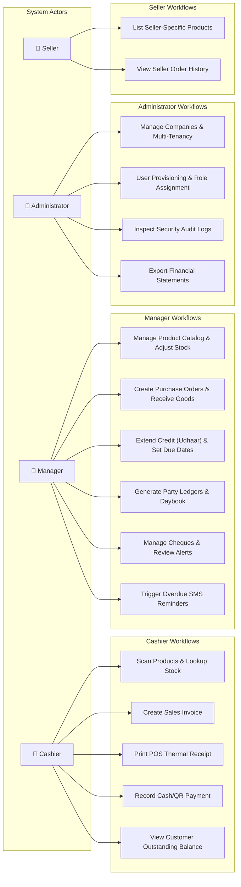

# Visual Architecture: Role-Based Use Case Diagram

> **BizFlow Operational Actors & Actions**  
> *Interactions across Cashier, Manager, Administrator, and Seller rendered in Mermaid.*

---

```mermaid
graph LR
    subgraph Actors["System Actors"]
        Cashier["👤 Cashier"]
        Manager["👤 Manager"]
        Admin["👤 Administrator"]
        Seller["👤 Seller"]
    end

    subgraph CashierUseCases["Cashier Workflows"]
        UC1["Scan Products & Lookup Stock"]
        UC2["Create Sales Invoice"]
        UC3["Print POS Thermal Receipt"]
        UC4["Record Cash/QR Payment"]
        UC5["View Customer Outstanding Balance"]
    end

    subgraph ManagerUseCases["Manager Workflows"]
        UC6["Manage Product Catalog & Adjust Stock"]
        UC7["Create Purchase Orders & Receive Goods"]
        UC8["Extend Credit (Udhaar) & Set Due Dates"]
        UC9["Generate Party Ledgers & Daybook"]
        UC10["Manage Cheques & Review Alerts"]
        UC11["Trigger Overdue SMS Reminders"]
    end

    subgraph AdminUseCases["Administrator Workflows"]
        UC12["Manage Companies & Multi-Tenancy"]
        UC13["User Provisioning & Role Assignment"]
        UC14["Inspect Security Audit Logs"]
        UC15["Export Financial Statements"]
    end

    subgraph SellerUseCases["Seller Workflows"]
        UC16["List Seller-Specific Products"]
        UC17["View Seller Order History"]
    end

    Cashier --> UC1
    Cashier --> UC2
    Cashier --> UC3
    Cashier --> UC4
    Cashier --> UC5

    Manager --> UC6
    Manager --> UC7
    Manager --> UC8
    Manager --> UC9
    Manager --> UC10
    Manager --> UC11

    Admin --> UC12
    Admin --> UC13
    Admin --> UC14
    Admin --> UC15

    Seller --> UC16
    Seller --> UC17
```
